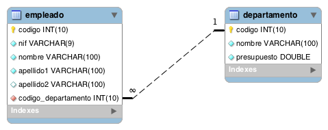

# Empleados

## Contenido

  - [Diagrama-ER](#diagrama-er)
  - [Tablas](#tablas)
  - [Consultas sencillas](#consultas-sencillas)
  - [Composición interna](#composición-interna)
  - [Composición externa](#composición-externa)
  - [Consultas resumen](#consultas-resumen)
  - [Subconsultas](#subconsultas)

## Diagrama ER


## Tablas

### Empleado

| id  | nif        | nombre       | apellido1 | apellido2 | id_departamento |
|-----|------------|--------------|-----------|-----------|-----------------|
| 1   | 32481596F  | Aarón        | Rivero    | Gómez     | 1               |
| 2   | Y5575632D  | Adela        | Salas     | Díaz      | 2               |
| 3   | R6970642B  | Adolfo       | Rubio     | Flores    | 3               |
| 4   | 77705545E  | Adrián       | Suárez    |           | 4               |
| 5   | 17087203C  | Marcos       | Loyola    | Méndez    | 5               |
| 6   | 38382980M  | María        | Santana   | Moreno    | 1               |
| 7   | 80576669X  | Pilar        | Ruiz      |           | 2               |
| 8   | 71651431Z  | Pepe         | Ruiz      | Santana   | 3               |
| 9   | 56399183D  | Juan         | Gómez     | López     | 2               |
| 10  | 46384486H  | Diego        | Flores    | Salas     | 5               |
| 11  | 67389283A  | Marta        | Herrera   | Gil       | 1               |
| 12  | 41234836R  | Irene        | Salas     | Flores    |                 |
| 13  | 82635162B  | Juan Antonio | Sáez      | Guerrero  |                 |


### Departamento

| id  | nombre             | presupuesto | gastos |
|-----|--------------------|-------------|--------|
| 1   | Desarrollo         | 120000      | 6000   |
| 2   | Sistemas           | 150000      | 21000  |
| 3   | Recursos Humanos   | 280000      | 25000  |
| 4   | Contabilidad       | 110000      | 3000   |
| 5   | I+D                | 375000      | 380000 |
| 6   | Proyectos          | 0           | 0      |
| 7   | Publicidad         | 0           | 1000   |


## Consultas sencillas

1. Lista el primer apellido de todos los empleados.

```sql
SELECT e.apellido1
FROM empleado e
```

2. Lista el primer apellido de los empleados eliminando los apellidos que estén repetidos.

```sql
SELECT DISTINCT e.apellido1
FROM empleado e
```

3. Lista todas las columnas de la tabla empleado.

```sql
SELECT *
FROM empleado
```

4. Lista el nombre y los apellidos de todos los empleados.

```sql
SELECT e.nombre, e.apellido1, e.apellido2
FROM empleado e
```

5. Lista el identificador de los departamentos de los empleados que aparecen en la tabla empleado.

```sql
SELECT id_departamento
FROM empleado
```

6. Lista el identificador de los departamentos de los empleados que aparecen en la tabla empleado, eliminando los identificadores que aparecen repetidos.

```sql
SELECT DISTINCT id_departamento
FROM empleado
```

7. Lista el nombre y apellidos de los empleados en una única columna.

```sql
SELECT CONCAT_WS(' ', e.nombre, e.apellido1, e.apellido2)
FROM empleado e
```

8. Lista el nombre y apellidos de los empleados en una única columna, convirtiendo todos los caracteres en mayúscula.

```sql
SELECT UPPER(CONCAT_WS(' ', e.nombre, e.apellido1, e.apellido2))
FROM empleado e
```

9. Lista el nombre y apellidos de los empleados en una única columna, convirtiendo todos los caracteres en minúscula.

```sql
SELECT LOWER(CONCAT_WS(' ', e.nombre, e.apellido1, e.apellido2))
FROM empleado e
```

10. Lista el identificador de los empleados junto al nif, pero el nif deberá aparecer en dos columnas, una mostrará únicamente los dígitos del nif y la otra la letra.

```sql
SELECT e.id, SUBSTRING(e.nif, 1, 8) AS NUMERO, SUBSTRING(e.nif, -1) AS LETRA
FROM empleado e
```

11. Lista el nombre de cada departamento y el valor del presupuesto actual del que dispone. Para calcular este dato tendrá que restar al valor del presupuesto inicial (columna presupuesto) los gastos que se han generado (columna gastos). Tenga en cuenta que en algunos casos pueden existir valores negativos. Utilice un alias apropiado para la nueva columna columna que está calculando.

```sql
SELECT d.nombre, d.presupuesto - d.gastos AS PRESUPUESTO
FROM departamento d
```

12. Lista el nombre de los departamentos y el valor del presupuesto actual ordenado de forma ascendente.

```sql
SELECT d.nombre, d.presupuesto - d.gastos AS PRESUPUESTO
FROM departamento d
ORDER BY PRESUPUESTO ASC
```

13. Lista el nombre de todos los departamentos ordenados de forma ascendente.

```sql
SELECT d.nombre
FROM departamento d
ORDER BY d.nombre ASC
```

14. Lista el nombre de todos los departamentos ordenados de forma descendente.

```sql
SELECT d.nombre
FROM departamento d
ORDER BY d.nombre DESC
```

15. Lista los apellidos y el nombre de todos los empleados, ordenados de forma alfabética tendiendo en cuenta en primer lugar sus apellidos y luego su nombre.

```sql
SELECT e.apellido1, e.apellido2, e.nombre
FROM empleado e
ORDER BY e.apellido1 ASC, e.apellido2 ASC, e.nombre ASC
```

16. Devuelve una lista con el nombre y el presupuesto, de los 3 departamentos que tienen mayor presupuesto.

```sql
SELECT d.nombre, d.presupuesto
FROM departamento d
ORDER BY d.presupuesto DESC
LIMIT 3
```

17. Devuelve una lista con el nombre y el presupuesto, de los 3 departamentos que tienen menor presupuesto.

```sql
SELECT d.nombre, d.presupuesto
FROM departamento d
ORDER BY d.presupuesto ASC
LIMIT 3
```

18. Devuelve una lista con el nombre y el gasto, de los 2 departamentos que tienen mayor gasto.

```sql
SELECT d.nombre, d.gastos
FROM departamento d
ORDER BY d.gastos DESC
LIMIT 2
```

19. Devuelve una lista con el nombre y el gasto, de los 2 departamentos que tienen menor gasto.

```sql
SELECT d.nombre, d.gastos
FROM departamento d
ORDER BY d.gastos ASC
LIMIT 2
```

20. Devuelve una lista con 5 filas a partir de la tercera fila de la tabla empleado. La tercera fila se debe incluir en la respuesta. La respuesta debe incluir todas las columnas de la tabla empleado.

```sql
SELECT *
FROM empleado e
LIMIT 5
OFFSET 2
```

21. Devuelve una lista con el nombre de los departamentos y el presupuesto, de aquellos que tienen un presupuesto mayor o igual a 150000 euros.

```sql
SELECT d.nombre, d.presupuesto
FROM departamento d
WHERE d.presupuesto>=150000
```

22. Devuelve una lista con el nombre de los departamentos y el gasto, de aquellos que tienen menos de 5000 euros de gastos.

```sql
SELECT d.nombre, d.gastos
FROM departamento d
WHERE d.gastos<5000
```

23. Devuelve una lista con el nombre de los departamentos y el presupuesto, de aquellos que tienen un presupuesto entre 100000 y 200000 euros. Sin utilizar el operador BETWEEN.

```sql
SELECT d.nombre, d.presupuesto
FROM departamento d
WHERE d.presupuesto>10000 AND d.presupuesto<200000
```

24. Devuelve una lista con el nombre de los departamentos que no tienen un presupuesto entre 100000 y 200000 euros. Sin utilizar el operador BETWEEN.

```sql
SELECT d.nombre, d.presupuesto
FROM departamento d
WHERE d.presupuesto<10000 OR d.presupuesto>200000
```

25. Devuelve una lista con el nombre de los departamentos que tienen un presupuesto entre 100000 y 200000 euros. Utilizando el operador BETWEEN.

```sql
SELECT d.nombre, d.presupuesto
FROM departamento d
WHERE d.presupuesto BETWEEN 100000 AND 200000
```

26. Devuelve una lista con el nombre de los departamentos que no tienen un presupuesto entre 100000 y 200000 euros. Utilizando el operador BETWEEN.

```sql
SELECT d.nombre, d.presupuesto
FROM departamento d
WHERE d.presupuesto NOT BETWEEN 100000 AND 200000
```

27. Devuelve una lista con el nombre de los departamentos, gastos y presupuesto, de aquellos departamentos donde los gastos sean mayores que el presupuesto del que disponen.

```sql
SELECT d.nombre, d.gastos, d.presupuesto
FROM departamento d
WHERE d.gastos>d.presupuesto
```

28. Devuelve una lista con el nombre de los departamentos, gastos y presupuesto, de aquellos departamentos donde los gastos sean menores que el presupuesto del que disponen.

```sql
SELECT d.nombre, d.gastos, d.presupuesto
FROM departamento d
WHERE d.gastos<d.presupuesto
```
29. Devuelve una lista con el nombre de los departamentos, gastos y presupuesto, de aquellos departamentos donde los gastos sean iguales al presupuesto del que disponen.

```sql
SELECT d.nombre, d.gastos, d.presupuesto
FROM departamento d
WHERE d.gastos=d.presupuesto
```

30. Lista todos los datos de los empleados cuyo segundo apellido no sea NULL.

```sql
SELECT *
FROM empleado e
WHERE e.apellido2 IS NULL
```

31. Lista todos los datos de los empleados cuyo segundo apellido no sea NULL.

```sql
SELECT *
FROM empleado e
WHERE e.apellido2 IS NOT NULL
```

32. Lista todos los datos de los empleados cuyo segundo apellido sea López.

```sql
SELECT *
FROM empleado e
WHERE e.apellido2="López"
```

33. Lista todos los datos de los empleados cuyo segundo apellido sea Díaz o Moreno. Sin utilizar el operador IN.

```sql
SELECT *
FROM empleado e
WHERE e.apellido2="Díaz" OR e.apellido2="Moreno"
```

34. Lista todos los datos de los empleados cuyo segundo apellido sea Díaz o Moreno. Utilizando el operador IN.

```sql
SELECT *
FROM empleado e
WHERE e.apellido2 IN ("Díaz", "Moreno")
```

35. Lista los nombres, apellidos y nif de los empleados que trabajan en el departamento 3.

```sql
SELECT e.nombre, e.apellido1, e.apellido2, e.nif
FROM empleado e
WHERE e.id_departamento=3
```

36. Lista los nombres, apellidos y nif de los empleados que trabajan en los departamentos 2, 4 o 5.

```sql
SELECT e.nombre, e.apellido1, e.apellido2, e.nif
FROM empleado e
WHERE e.id_departamento IN (2,4,5)
```

## Composición interna

1. Devuelve un listado con los empleados y los datos de los departamentos donde trabaja cada uno.

```sql
SELECT *
FROM empleado e
INNER JOIN departamento d ON e.id_departamento=d.id
```

2. Devuelve un listado con los empleados y los datos de los departamentos donde trabaja cada uno. Ordena el resultado, en primer lugar por el nombre del departamento (en orden alfabético) y en segundo lugar por los apellidos y el nombre de los empleados.

```sql
SELECT *
FROM empleado e
INNER JOIN departamento d ON e.id_departamento=d.id
ORDER BY d.nombre ASC, e.apellido1, e.nombre
```

3. Devuelve un listado con el identificador y el nombre del departamento, solamente de aquellos departamentos que tienen empleados.

```sql
SELECT DISTINCT d.id, d.nombre
FROM departamento d
INNER JOIN empleado e ON d.id=e.id_departamento
```

4. Devuelve un listado con el identificador, el nombre del departamento y el valor del presupuesto actual del que dispone, solamente de aquellos departamentos que tienen empleados. El valor del presupuesto actual lo puede calcular restando al valor del presupuesto inicial (columna presupuesto) el valor de los gastos que ha generado (columna gastos).

```sql
SELECT DISTINCT d.id, d.nombre, (d.presupuesto - d.gastos) AS PRESUPUESTO_ACTUAL
FROM departamento d
INNER JOIN empleado e ON d.id=e.id_departamento
```

5. Devuelve el nombre del departamento donde trabaja el empleado que tiene el nif 38382980M.

```sql
SELECT d.nombre
FROM departamento d
INNER JOIN empleado e ON e.id_departamento=d.id
WHERE e.nif="38382980M"
```

6. Devuelve el nombre del departamento donde trabaja el empleado Pepe Ruiz Santana.

```sql
SELECT d.nombre
FROM departamento d
INNER JOIN empleado e ON e.id_departamento=d.id
WHERE e.nombre="Pepe" AND e.apellido1="Ruiz" AND e.apellido2="Santana"
```

7. Devuelve un listado con los datos de los empleados que trabajan en el departamento de I+D. Ordena el resultado alfabéticamente.

```sql
SELECT e.id, e.nif, e.nombre, e.apellido1, e.apellido2, e.id_departamento
FROM empleado e
INNER JOIN departamento d ON d.id=e.id_departamento
WHERE d.nombre="I+D"
```

8. Devuelve un listado con los datos de los empleados que trabajan en el departamento de Sistemas, Contabilidad o I+D. Ordena el resultado alfabéticamente.

```sql
SELECT e.id, e.nombre, e.nif, e.apellido1, e.apellido2
FROM empleado e
INNER JOIN departamento d ON d.id=e.id_departamento
WHERE d.nombre IN ("Sistemas", "Contabilidad", "I+D")
```

9. Devuelve una lista con el nombre de los empleados que tienen los departamentos que no tienen un presupuesto entre 100000 y 200000 euros.

```sql
SELECT e.nombre
FROM empleado e
INNER JOIN departamento d ON d.id=e.id_departamento
WHERE d.presupuesto NOT BETWEEN 100000 AND 200000
```

10. Devuelve un listado con el nombre de los departamentos donde existe algún empleado cuyo segundo apellido sea NULL. Tenga en cuenta que no debe mostrar nombres de departamentos que estén repetidos.

```sql
SELECT DISTINCT d.nombre
FROM departamento d
INNER JOIN empleado e ON e.id_departamento=d.id AND e.apellido2 IS NULL
```

## Composición externa

1. Devuelve un listado con los empleados y los datos de los departamentos donde trabaja cada uno. Muestre también aquellos empleados no adscritos a ningún departamento.

```sql
SELECT *
FROM empleado e
LEFT JOIN departamento d ON d.id=e.id_departamento
```

2. Devuelve un listado con los empleados y los datos de los departamentos donde trabaja cada uno. Ordena el resultado, en primer lugar por el nombre del departamento (en orden alfabético) y en segundo lugar por los apellidos y el nombre de los empleados.

```sql
SELECT *
FROM empleado e
INNER JOIN departamento d ON d.id=e.id_departamento
ORDER BY d.nombre ASC, e.apellido1, e.apellido2, e.nombre
```

3. Devuelve un listado con el identificador y el nombre del departamento, solamente de aquellos departamentos que tienen empleados.

```sql
SELECT DISTINCT d.id, d.nombre
FROM departamento d
INNER JOIN empleado e ON d.id=e.id_departamento
```

4. Devuelve un listado con el identificador, el nombre del departamento y el valor del presupuesto actual del que dispone, solamente de aquellos departamentos que tienen empleados. El valor del presupuesto actual lo puede calcular restando al valor del presupuesto inicial (columna presupuesto) el valor de los gastos que ha generado (columna gastos).

```sql
SELECT DISTINCT d.id, d.nombre, (d.presupuesto - d.gastos) AS PRESUPUESTO_ACTUAL
FROM departamento d
INNER JOIN empleado e ON e.id_departamento=d.id
```

5. Devuelve el nombre del departamento donde trabaja el empleado que tiene el nif 38382980M.

```sql
SELECT d.nombre
FROM departamento d
INNER JOIN empleado e ON e.id_departamento=d.id
WHERE e.nif="38382980M"
```

6. Devuelve el nombre del departamento donde trabaja el empleado Pepe Ruiz Santana.

```sql
SELECT d.nombre
FROM departamento d
INNER JOIN empleado e ON e.id_departamento=d.id
WHERE e.nombre="Pepe" AND e.apellido1="Ruiz" AND e.apellido2="Santana"
```

7. Devuelve un listado con los datos de los empleados que trabajan en el departamento de I+D. Ordena el resultado alfabéticamente.

```sql
SELECT e.id, e.nif, e.nombre, e.apellido1, e.apellido2, e.id_departamento
FROM empleado e
INNER JOIN departamento d ON d.id=e.id_departamento
WHERE d.nombre="I+D"
```

8. Devuelve un listado con los datos de los empleados que trabajan en el departamento de Sistemas, Contabilidad o I+D. Ordena el resultado alfabéticamente.

```sql
SELECT e.id, e.nombre, e.nif, e.apellido1, e.apellido2
FROM empleado e
INNER JOIN departamento d ON d.id=e.id_departamento
WHERE d.nombre IN ("Sistemas", "Contabilidad", "I+D")
```

9. Devuelve una lista con el nombre de los empleados que tienen los departamentos que no tienen un presupuesto entre 100000 y 200000 euros.

```sql
SELECT e.nombre
FROM empleado e
INNER JOIN departamento d ON d.id=e.id_departamento
WHERE d.presupuesto NOT BETWEEN 100000 AND 200000
```

10. Devuelve un listado con el nombre de los departamentos donde existe algún empleado cuyo segundo apellido sea NULL. Tenga en cuenta que no debe mostrar nombres de departamentos que estén repetidos.

```sql
SELECT DISTINCT d.nombre
FROM departamento d
INNER JOIN empleado e ON e.id_departamento=d.id AND e.apellido2 IS NULL
```


## Consultas resumen

1. Calcula la suma del presupuesto de todos los departamentos.

```sql
SELECT SUM(d.presupuesto)
FROM departamento d
```

2. Calcula la media del presupuesto de todos los departamentos.

```sql
SELECT AVG(d.presupuesto)
FROM departamento d
```

3. Calcula el valor mínimo del presupuesto de todos los departamentos.

```sql
SELECT MIN(d.presupuesto)
FROM departamento d
```

4. Calcula el nombre del departamento y el presupuesto que tiene asignado, del departamento con menor presupuesto.

```sql
SELECT d.nombre, d.presupuesto
FROM departamento d
WHERE d.presupuesto=(
    SELECT MIN(d2.presupuesto) 
    FROM departamento d2
)
```

5. Calcula el valor máximo del presupuesto de todos los departamentos.

```sql
SELECT MAX(d.presupuesto)
FROM departamento d
```

6. Calcula el nombre del departamento y el presupuesto que tiene asignado, del departamento con mayor presupuesto.

```sql
SELECT d.nombre, d.presupuesto
FROM departamento d
WHERE d.presupuesto=(
    SELECT MAX(d2.presupuesto) 
    FROM departamento d2
)
```

7. Calcula el número total de empleados que hay en la tabla empleado.

```sql
SELECT COUNT(*)
FROM empleado e
```

8. Calcula el número de empleados que no tienen NULL en su segundo apellido.

```sql
SELECT COUNT(*)
FROM empleado e
WHERE e.apellido2 IS NOT NULL
```

9. Calcula el número de empleados que hay en cada departamento. Tienes que devolver dos columnas, una con el nombre del departamento y otra con el número de empleados que tiene asignados.

```sql
SELECT d.nombre, COUNT(*) AS TOTAL_EMPLEADOS
FROM empleado e
INNER JOIN departamento d ON d.id=e.id_departamento
GROUP BY d.nombre
```

10. Calcula el nombre de los departamentos que tienen más de 2 empleados. El resultado debe tener dos columnas, una con el nombre del departamento y otra con el número de empleados que tiene asignados.

```sql
SELECT d.nombre, COUNT(*) AS TOTAL_EMPLEADOS
FROM empleado e
INNER JOIN departamento d ON d.id=e.id_departamento
GROUP BY d.nombre
HAVING TOTAL_EMPLEADOS>2
```

11. Calcula el número de empleados que trabajan en cada uno de los departamentos. El resultado de esta consulta también tiene que incluir aquellos departamentos que no tienen ningún empleado asociado.

```sql
SELECT d.nombre, COUNT(e.nombre) AS 'Cantidad'
FROM empleado e 
RIGHT JOIN departamento d ON e.id_departamento = d.id
GROUP BY d.nombre
```

12. Calcula el número de empleados que trabajan en cada unos de los departamentos que tienen un presupuesto mayor a 200000 euros.

```sql
SELECT d.nombre, COUNT() AS TOTAL_EMPLEADOS
FROM empleado e
INNER JOIN departamento d ON d.id=e.id_departamento AND d.presupuesto>200000
GROUP BY d.id
```

## Subconsultas