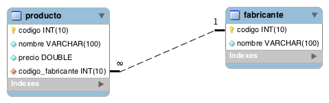

# Tienda Informática

## Contenido

  - [Diagrama-ER](#diagrama-er)
  - [Consultas sencillas](#consultas-sencillas)
  - [Composición interna](#composición-interna)
  - [Composición externa](#composición-externa)
  - [Consultas resumen](#consultas-resumen)
  - [Subconsultas](#subconsultas)
  - [Anexo: Tablas](#tablas)

## Diagrama ER



## Consultas sencillas

1. Lista el nombre de todos los productos que hay en la tabla `producto`.

```sql
SELECT p.nombre
FROM producto p
```

2. Lista los nombres y los precios de todos los productos de la tabla `producto`.

```sql
SELECT p.nombre, p.precio
FROM producto p
```

3. Lista todas las columnas de la tabla producto.

```sql
SELECT *
FROM producto
```

4. Lista el nombre de los productos, el precio en euros y el precio en dólares estadounidenses (USD).

```sql
SELECT p.nombre, p.precio AS EUROS, p.precio*1.15 AS DOLARES
FROM producto p
```

5. Lista el nombre de los productos, el precio en euros y el precio en dólares estadounidenses (USD). Utiliza los siguientes alias para las columnas: nombre de producto, euros, dólares.

```sql
SELECT p.nombre AS NOMBRE_PRODUCTO, p.precio AS EUROS, p.precio*1.15 AS DOLARES
FROM producto p
```

6. Lista los nombres y los precios de todos los productos de la tabla producto, convirtiendo los nombres a mayúscula.

```sql
SELECT UPPER(p.nombre), p.precio
FROM producto p
```

7. Lista los nombres y los precios de todos los productos de la tabla producto, convirtiendo los nombres a minúscula.

```sql
SELECT LOWER(p.nombre), p.precio
FROM producto p
```

8. Lista el nombre de todos los fabricantes en una columna, y en otra columna obtenga en mayúsculas los dos primeros caracteres del nombre del fabricante.

```sql
SELECT f.Nombre, UPPER(SUBSTR(f.nombre, 1, 2))
FROM fabricante f
```

9. Lista los nombres y los precios de todos los productos de la tabla producto, redondeando el valor del precio.

```sql
SELECT nombre, ROUND(precio) AS 'Precio'
FROM producto
```

10. Lista los nombres y los precios de todos los productos de la tabla producto, truncando el valor del precio para mostrarlo sin ninguna cifra decimal.

```sql
SELECT nombre, TRUNCATE(precio, 0) AS 'Precio'
FROM producto
```

11. Lista el código de los fabricantes que tienen productos en la tabla producto.

```sql
SELECT id_fabricante
FROM producto
```

12. Lista el código de los fabricantes que tienen productos en la tabla producto, eliminando códigos repetidos.

```sql
SELECT id_fabricante
FROM producto
```

13. Lista los nombres de los fabricantes ordenados de forma ascendente.

```sql
SELECT nombre 
FROM fabricante
ORDER BY nombre ASC
```

14. Lista los nombres de los fabricantes ordenados de forma descendente.

```sql
SELECT nombre 
FROM fabricante
ORDER BY nombre DESC
```

15. Lista los nombres de los productos ordenados en primer lugar por el nombre de forma ascendente y en segundo lugar por el precio de forma descendente.

```sql
SELECT nombre 
FROM producto
ORDER BY nombre ASC, PRECIO DESC
```

16. Devuelve una lista con las 5 primeras filas de la tabla fabricante.

```sql
SELECT *
FROM fabricante
LIMIT 5
```

17. Devuelve una lista con 2 filas a partir de la cuarta fila de la tabla fabricante. La cuarta fila también se debe incluir en la respuesta.

```sql
SELECT *
FROM fabricante
LIMIT 3, 2
```

18. Lista el nombre y el precio del producto más barato. (Utilice solamente las cláusulas ORDER BY y LIMIT)

```sql
SELECT nombre, precio
FROM producto
ORDER BY precio ASC
LIMIT 1
```

19. Lista el nombre y el precio del producto más caro. (Utilice solamente las cláusulas ORDER BY y LIMIT)

```sql
SELECT nombre, precio
FROM producto
ORDER BY precio DESC
LIMIT 1
```

20. Lista el nombre de todos los productos del fabricante cuyo código de fabricante es igual a 2.

```sql
SELECT nombre 
FROM producto p
WHERE p.id_fabricante = 2
```

21. Lista el nombre de los productos que tienen un precio menor o igual a 120€.

```sql
SELECT nombre
FROM producto
WHERE precio <= 120
```

22. Lista el nombre de los productos que tienen un precio mayor o igual a 400€.

```sql
SELECT nombre
FROM producto
WHERE precio >= 400
```

23. Lista el nombre de los productos que no tienen un precio mayor o igual a 400€.

```sql
SELECT nombre
FROM producto
WHERE NOT (precio >= 400)
```

24. Lista todos los productos que tengan un precio entre 80€ y 300€. Sin utilizar el operador BETWEEN.

```sql
SELECT nombre
FROM producto
WHERE precio > 80 AND precio < 300
```

25. Lista todos los productos que tengan un precio entre 60€ y 200€. Utilizando el operador BETWEEN.

```sql
SELECT nombre
FROM producto
WHERE precio BETWEEN 60 AND 200
```

26. Lista todos los productos que tengan un precio mayor que 200€ y que el código de fabricante sea igual a 6.

```sql
SELECT p.nombre
FROM producto p
WHERE p.precio > 200 AND p.id_fabricante = 6
```

27. Lista todos los productos donde el código de fabricante sea 1, 3 o 5. Sin utilizar el operador IN.

```sql
SELECT p.nombre
FROM producto p
WHERE p.id_fabricante = 1 OR p.id_fabricante = 3 OR p.id_fabricante = 5
```

28. Lista todos los productos donde el código de fabricante sea 1, 3 o 5. Utilizando el operador IN.

```sql
SELECT p.nombre
FROM producto p
WHERE p.id_fabricante IN (1, 3, 5)
```

29. Lista el nombre y el precio de los productos en céntimos (Habrá que multiplicar por 100 el valor del precio). Cree un alias para la columna que contiene el precio que se llame céntimos.

```sql
SELECT nombre, (precio * 100) AS Céntimos
FROM producto 
```

30. Lista los nombres de los fabricantes cuyo nombre empiece por la letra S.

```sql
SELECT nombre 
FROM fabricante 
WHERE nombre LIKE "s%"
```

31. Lista los nombres de los fabricantes cuyo nombre termine por la vocal e.

```sql
SELECT nombre 
FROM fabricante 
WHERE nombre LIKE "%e"
```

32. Lista los nombres de los fabricantes cuyo nombre contenga el carácter w.

```sql
SELECT nombre 
FROM fabricante 
WHERE nombre LIKE "%w%"
```

33. Lista los nombres de los fabricantes cuyo nombre sea de 4 caracteres.

```sql
SELECT nombre 
FROM fabricante 
WHERE LENGTH(nombre) = 4
```

34. Devuelve una lista con el nombre de todos los productos que contienen la cadena Portátil en el nombre.

```sql
SELECT nombre 
FROM producto 
WHERE nombre LIKE "%Portátil%"
```

35. Devuelve una lista con el nombre de todos los productos que contienen la cadena Monitor en el nombre y tienen un precio inferior a 215 €.

```sql
SELECT nombre 
FROM producto 
WHERE nombre LIKE "%Monitor%" AND precio < 215
```

36. Lista el nombre y el precio de todos los productos que tengan un precio mayor o igual a 180€. Ordene el resultado en primer lugar por el precio (en orden descendente) y en segundo lugar por el nombre (en orden ascendente).

```sql
SELECT nombre, precio
FROM producto
WHERE precio >= 180
ORDER BY precio DESC, nombre ASC
```

## Composición interna

1. Devuelve una lista con el nombre del producto, precio y nombre de fabricante de todos los productos de la base de datos.

```sql
SELECT p.nombre, p.precio, f.nombre
FROM producto p
INNER JOIN fabricante f ON f.id=p.id_fabricante
```

2. Devuelve una lista con el nombre del producto, precio y nombre de fabricante de todos los productos de la base de datos. Ordene el resultado por el nombre del fabricante, por orden alfabético.

```sql
SELECT p.nombre, p.precio, f.nombre
FROM producto p
INNER JOIN fabricante f ON f.id=p.id_fabricante
ORDER BY f.nombre ASC
```

3. Devuelve una lista con el identificador del producto, nombre del producto, identificador del fabricante y nombre del fabricante, de todos los productos de la base de datos.

```sql
SELECT p.id, p.nombre, f.id, f.nombre
FROM producto p
INNER JOIN fabricante f ON f.id=p.id_fabricante
```

4. Devuelve el nombre del producto, su precio y el nombre de su fabricante, del producto más barato.

```sql
SELECT p.nombre, p.precio, f.nombre
FROM producto p
INNER JOIN fabricante f ON f.id=p.id_fabricante
ORDER BY p.precio
LIMIT 1
```

5. Devuelve el nombre del producto, su precio y el nombre de su fabricante, del producto más caro.

```sql
SELECT p.nombre, p.precio, f.nombre
FROM producto p
INNER JOIN fabricante f ON f.id=p.id_fabricante
ORDER BY p.precio DESC 
LIMIT 1
```

6. Devuelve una lista de todos los productos del fabricante Lenovo.

```sql
SELECT *
FROM producto p
INNER JOIN fabricante f ON f.id=p.id_fabricante
WHERE f.nombre="Lenovo"
```

7. Devuelve una lista de todos los productos del fabricante Crucial que tengan un precio mayor que 200€.

```sql
SELECT *
FROM producto p
INNER JOIN fabricante f ON f.id=p.id_fabricante
WHERE f.nombre="Crucial" AND p.precio>200
```

8. Devuelve un listado con todos los productos de los fabricantes Asus, Hewlett-Packardy Seagate. Sin utilizar el operador IN.

```sql
SELECT *
FROM producto p
INNER JOIN fabricante f ON f.id=p.id_fabricante
WHERE f.nombre="Asus" OR f.nombre="Hewlett-Packard" OR f.nombre="Seagate"
```

10. Devuelve un listado con el nombre y el precio de todos los productos de los fabricantes cuyo nombre termine por la vocal e.

```sql
SELECT *
FROM producto p
INNER JOIN fabricante f ON f.id=p.id_fabricante
WHERE f.nombre LIKE "%e"
```

11. Devuelve un listado con el nombre y el precio de todos los productos cuyo nombre de fabricante contenga el carácter w en su nombre.

```sql
SELECT *
FROM producto p
INNER JOIN fabricante f ON f.id=p.id_fabricante
WHERE f.nombre LIKE "%w%"
```

12. Devuelve un listado con el nombre de producto, precio y nombre de fabricante, de todos los productos que tengan un precio mayor o igual a 180€. Ordene el resultado en primer lugar por el precio (en orden descendente) y en segundo lugar por el nombre (en orden ascendente)

```sql
SELECT *
FROM producto p
INNER JOIN fabricante f ON f.id=p.id_fabricante
WHERE p.precio >= 180
ORDER BY p.precio DESC, p.nombre ASC
```

13. Devuelve un listado con el identificador y el nombre de fabricante, solamente de aquellos fabricantes que tienen productos asociados en la base de datos.

```sql
SELECT DISTINCT f.id, f.nombre
FROM fabricante f
INNER JOIN producto p ON f.id=p.id_fabricante
```

## Composición externa

1. Devuelve un listado de todos los fabricantes que existen en la base de datos, junto con los productos que tiene cada uno de ellos. El listado deberá mostrar también aquellos fabricantes que no tienen productos asociados.

```sql
SELECT *
FROM fabricante f
LEFT JOIN producto p ON p.id_fabricante=f.id
```

2. Devuelve un listado donde sólo aparezcan aquellos fabricantes que no tienen ningún producto asociado.

```sql
SELECT *
FROM fabricante f
LEFT JOIN producto p ON p.id_fabricante=f.id
WHERE p.id_fabricante IS NULL
```

o bien:

```sql
SELECT *
FROM fabricante f
WHERE f.id NOT IN (SELECT DISTINCT p.id_fabricante FROM producto p)
```


## Consultas resumen

1. Calcula el número total de productos que hay en la tabla productos.

```sql
SELECT COUNT(*)
FROM producto
```

2. Calcula el número total de fabricantes que hay en la tabla fabricante.

```sql
SELECT COUNT(*)
FROM fabricante
```

3. Calcula el número de valores distintos de identificador de fabricante aparecen en la tabla productos.

```sql
SELECT COUNT(DISTINCT p.id_fabricante)
FROM producto p
```

4. Calcula la media del precio de todos los productos.

```sql
SELECT AVG(p.precio)
FROM producto p
```

5. Calcula el precio más barato de todos los productos.

```sql
SELECT MIN(p.precio)
FROM producto p
```

6. Calcula el precio más caro de todos los productos.

```sql
SELECT MAX(p.precio)
FROM producto p
```

7. Lista el nombre y el precio del producto más barato.

```sql
SELECT p.nombre, p.precio
FROM producto p
ORDER BY p.precio ASC
LIMIT 1
```

8. Lista el nombre y el precio del producto más caro.

```sql
SELECT p.nombre, p.precio
FROM producto p
ORDER BY p.precio DESC
LIMIT 1
```

también puede hacerse:

```sql
SELECT p.nombre, p.precio
FROM producto p
WHERE p.precio = (SELECT MAX(p2.precio) FROM producto p2)
```

9. Calcula la suma de los precios de todos los productos.

```sql
SELECT SUM(p.precio)
FROM producto p
```

10. Calcula el número de productos que tiene el fabricante Asus.

```sql
SELECT COUNT(*)
FROM producto p
INNER JOIN fabricante f ON f.id=p.id_fabricante
WHERE f.nombre = "Asus"
```

11. Calcula la media del precio de todos los productos del fabricante Asus.

```sql
SELECT AVG(p.precio)
FROM producto p
INNER JOIN fabricante f ON f.id=p.id_fabricante
WHERE f.nombre = "Asus"
```

12. Calcula el precio más barato de todos los productos del fabricante Asus.

```sql
SELECT MIN(p.precio)
FROM producto p
INNER JOIN fabricante f ON f.id=p.id_fabricante
WHERE f.nombre = "Asus"
```

13. Calcula el precio más caro de todos los productos del fabricante Asus.

```sql
SELECT MAX(p.precio)
FROM producto p
INNER JOIN fabricante f ON f.id=p.id_fabricante
WHERE f.nombre = "Asus"
```

14. Calcula la suma de todos los productos del fabricante Asus.

```sql
SELECT SUM(p.precio)
FROM producto p
INNER JOIN fabricante f ON f.id=p.id_fabricante
WHERE f.nombre = "Asus"
```

15. Muestra el precio máximo, precio mínimo, precio medio y el número total de productos que tiene el fabricante Crucial.

```sql
SELECT MAX(p.precio) AS PRECIO_MAXIMO, MIN(p.precio) AS PRECIO_MINIMO, AVG(p.precio) AS PRECIO_MEDIO, COUNT(*) AS TOTAL_PRODUCTOS
FROM producto p
INNER JOIN fabricante f ON f.id=p.id_fabricante
WHERE f.nombre = "Crucial"
```

16. Muestra el número total de productos que tiene cada uno de los fabricantes. El listado también debe incluir los fabricantes que no tienen ningún producto. El resultado mostrará dos columnas, una con el nombre del fabricante y otra con el número de productos que tiene. Ordene el resultado descendentemente por el número de productos.

```sql
SELECT f.nombre, COUNT(p.id_fabricante) AS TOTAL_PRODUCTOS
FROM fabricante f
LEFT JOIN producto p ON p.id_fabricante=f.id
GROUP BY f.id
ORDER BY TOTAL_PRODUCTOS DESC
```

17. Muestra el precio máximo, precio mínimo y precio medio de los productos de cada uno de los fabricantes. El resultado mostrará el nombre del fabricante junto con los datos que se solicitan.

```sql
SELECT f.nombre, MAX(p.precio), MIN(p.precio), AVG(p.precio)
FROM producto p
INNER JOIN fabricante f ON f.id=p.id_fabricante
GROUP BY f.id
```

18. Muestra el precio máximo, precio mínimo, precio medio y el número total de productos de los fabricantes que tienen un precio medio superior a 200€. No es necesario mostrar el nombre del fabricante, con el identificador del fabricante es suficiente.

```sql
SELECT p.id_fabricante, MAX(p.precio), MIN(p.precio), AVG(p.precio), COUNT(*)
FROM producto p
GROUP BY p.id_fabricante
HAVING AVG(p.precio)>200
```

19. Muestra el nombre de cada fabricante, junto con el precio máximo, precio mínimo, precio medio y el número total de productos de los fabricantes que tienen un precio medio superior a 200€. Es necesario mostrar el nombre del fabricante.

```sql
SELECT f.nombre, MAX(p.precio), MIN(p.precio), AVG(p.precio), COUNT(*)
FROM producto p
INNER JOIN fabricante f ON f.id=p.id_fabricante
GROUP BY f.id
HAVING AVG(p.precio)>200
```

20. Calcula el número de productos que tienen un precio mayor o igual a 180€.

```sql
SELECT COUNT(*)
FROM producto
WHERE precio >= 180
```

21. Calcula el número de productos que tiene cada fabricante con un precio mayor o igual a 180€.

```sql
SELECT f.nombre, COUNT(*)
FROM producto p
INNER JOIN fabricante f ON f.id=p.id_fabricante
WHERE p.precio>=180
GROUP BY f.id
```

22. Lista el precio medio los productos de cada fabricante, mostrando solamente el identificador del fabricante.

```sql
SELECT AVG(precio), id_fabricante
FROM producto
GROUP BY id_fabricante
```

23. Lista el precio medio los productos de cada fabricante, mostrando solamente el nombre del fabricante.

```sql
SELECT AVG(p.precio), f.nombre
FROM producto p
INNER JOIN fabricante f ON f.id=p.id_fabricante
GROUP BY f.id
ORDER BY f.nombre
```

24. Lista los nombres de los fabricantes cuyos productos tienen un precio medio mayor o igual a 150€.

```sql
SELECT AVG(p.precio), f.nombre
FROM producto p
INNER JOIN fabricante f ON f.id=p.id_fabricante
GROUP BY f.id
HAVING AVG(p.precio) >= 150
ORDER BY f.nombre
```

25. Devuelve un listado con los nombres de los fabricantes que tienen 2 o más productos.

```sql
SELECT f.nombre, COUNT(p.id) AS TOTAL_PRODUCTOS
FROM fabricante f
LEFT JOIN producto p ON p.id_fabricante=f.id
GROUP BY f.id
HAVING TOTAL_PRODUCTOS >= 2
```

26. Devuelve un listado con los nombres de los fabricantes y el número de productos que tiene cada uno con un precio superior o igual a 220 €. No es necesario mostrar el nombre de los fabricantes que no tienen productos que cumplan la condición.

```sql
SELECT f.nombre, COUNT(p.id) 
FROM fabricante f
LEFT JOIN producto p ON p.id_fabricante=f.id
WHERE p.precio >= 220
GROUP BY f.id
```

27. Devuelve un listado con los nombres de los fabricantes y el número de productos que tiene cada uno con un precio superior o igual a 220 €. El listado debe mostrar el nombre de todos los fabricantes, es decir, si hay algún fabricante que no tiene productos con un precio superior o igual a 220€ deberá aparecer en el listado con un valor igual a 0 en el número de productos.

```sql
SELECT f.Nombre, COUNT(CASE WHEN p.precio >= 220 THEN f.nombre ELSE NULL END) AS 'TOTAL'
FROM fabricante f 
LEFT JOIN producto p ON p.id_fabricante = f.id
GROUP BY f.nombre
```

28. Devuelve un listado con los nombres de los fabricantes donde la suma del precio de todos sus productos es superior a 1000 €.

```sql
SELECT f.nombre, SUM(p.precio) AS SUM_PRECIO
FROM fabricante f
INNER JOIN producto p ON p.id_fabricante=f.id
GROUP BY f.id
HAVING SUM_PRECIO >= 1000
```

29. Devuelve un listado con el nombre del producto más caro que tiene cada fabricante. El resultado debe tener tres columnas: nombre del producto, precio y nombre del fabricante. El resultado tiene que estar ordenado alfabéticamente de menor a mayor por el nombre del fabricante.

```sql
SELECT f.nombre AS FABRICANTE, p.nombre AS PRODUCTO, p.precio
FROM producto p
INNER JOIN 
    fabricante f ON p.id_fabricante = f.id
LEFT JOIN 
    producto p2 ON p.id_fabricante = p2.id_fabricante AND p2.precio > p.precio
WHERE p2.id IS NULL
ORDER BY f.nombre
```

Explicación: Se hace un `LEFT JOIN` de producto consigo mismo (p y p2), para encontrar todos los productos de mayor precio del mismo fabricante.

Para el producto más caro, no existirá ningún p2 con un precio mayor, así que p2.id será `NULL`.

pero es más facil empleando subconsultas:

```sql
SELECT f.nombre AS FABRICANTE, p.nombre AS PRODUCTO, p.precio
FROM producto p
INNER JOIN fabricante f ON p.id_fabricante = f.id
WHERE p.precio = (
    SELECT MAX(p2.precio) 
    FROM producto p2 
    WHERE p.id_fabricante=p2.id_fabricante
)
ORDER BY f.nombre ASC
```

## Subconsultas

1. Devuelve todos los productos del fabricante Lenovo. (Sin utilizar INNER JOIN).

```sql
SELECT *
FROM producto p
WHERE p.id_fabricante = (
    SELECT f.id 
    FROM fabricante f 
    WHERE f.nombre = "Lenovo"
)
```

2. Devuelve todos los datos de los productos que tienen el mismo precio que el producto más caro del fabricante Lenovo. (Sin utilizar INNER JOIN).

```sql
SELECT *
FROM producto p
WHERE p.precio = (
    SELECT MAX(p2.precio)
    FROM producto p2
    WHERE p2.id_fabricante = (
        SELECT f.id 
        FROM fabricante f 
        WHERE f.nombre = "Lenovo"
    )
)
```

Este tipo de consultas tambien puede resolverse (además de con el `INNER JOIN`):

```sql
SELECT *
FROM producto p
WHERE p.precio = (SELECT MAX(p.precio)
                  FROM fabricante f, producto p 
                  WHERE f.codigo = p.codigo_fabricante AND f.nombre = 'Lenovo')
```

3. Lista el nombre del producto más caro del fabricante Lenovo.

```sql
SELECT p.nombre
FROM producto p
WHERE p.id_fabricante = (
    SELECT f.id
    FROM fabricante f
    WHERE f.nombre="Lenovo"
)
ORDER BY p.precio DESC
LIMIT 1
``` 

4. Lista el nombre del producto más barato del fabricante Hewlett-Packard.

```sql
SELECT p.nombre
FROM producto p
WHERE p.id_fabricante = (
    SELECT f.id
    FROM fabricante f
    WHERE f.nombre="Hewlett-Packard"
)
ORDER BY p.precio ASC
LIMIT 1
```

5. Devuelve todos los productos de la base de datos que tienen un precio mayor o igual al producto más caro del fabricante Lenovo.

```sql
SELECT *
FROM producto p
WHERE p.precio >= (
    SELECT MAX(p2.precio)
    FROM producto p2
    WHERE p2.id_fabricante = (
        SELECT f.id 
        FROM fabricante f 
        WHERE f.nombre = "Lenovo"
    )
)
```

6. Lista todos los productos del fabricante Asus que tienen un precio superior al precio medio de todos sus productos.

```sql
SELECT *
FROM producto p
WHERE p.id_fabricante = (
    SELECT f.id 
    FROM fabricante f 
    WHERE f.nombre="Asus")
AND p.precio > (
    SELECT AVG(p2.precio) 
    FROM producto p2 
    WHERE p2.id_fabricante = (
        SELECT f2.id
        FROM fabricante f2
        WHERE f2.nombre = "Asus"
    )
)
```

7. Devuelve el producto más caro que existe en la tabla producto sin hacer uso de MAX, ORDER BY ni LIMIT.

```sql
SELECT *
FROM producto p
WHERE p.precio >= ALL(SELECT p2.precio FROM producto p2)
```

8. Devuelve el producto más barato que existe en la tabla producto sin hacer uso de MIN, ORDER BY ni LIMIT.

```sql
SELECT *
FROM producto p
WHERE p.precio <= ALL(SELECT p2.precio FROM producto p2)
```

9. Devuelve los nombres de los fabricantes que tienen productos asociados. (Utilizando ALL o ANY).

```sql
SELECT f.nombre
FROM fabricante f
WHERE f.id = ANY (SELECT p.id_fabricante FROM producto p)
```

10. Devuelve los nombres de los fabricantes que no tienen productos asociados. (Utilizando ALL o ANY).

```sql
SELECT f.nombre
FROM fabricante f
WHERE f.id <> ALL (SELECT p.id_fabricante FROM producto p)
```

11. Devuelve los nombres de los fabricantes que tienen productos asociados. (Utilizando IN o NOT IN).

```sql
SELECT f.nombre
FROM fabricante f
WHERE f.id IN (SELECT p.id_fabricante FROM producto p)
```

12. Devuelve los nombres de los fabricantes que no tienen productos asociados. (Utilizando IN o NOT IN).

```sql
SELECT f.nombre
FROM fabricante f
WHERE f.id NOT IN (SELECT p.id_fabricante FROM producto p)
```

13. Devuelve los nombres de los fabricantes que tienen productos asociados. (Utilizando EXISTS o NOT EXISTS).

```sql
SELECT f.nombre
FROM fabricante f 
WHERE EXISTS (
    SELECT DISTINCT p.id_fabricante
    FROM producto p
    WHERE p.id_fabricante = f.id)
```

14. Devuelve los nombres de los fabricantes que no tienen productos asociados. (Utilizando EXISTS o NOT EXISTS).

```sql
SELECT f.nombre
FROM fabricante f 
WHERE NOT EXISTS (
    SELECT DISTINCT p.id_fabricante
    FROM producto p
    WHERE p.id_fabricante = f.id
)
```

15. Lista el nombre de cada fabricante con el nombre y el precio de su producto más caro. (consultar consulta 29 de consultas resumen)

```sql
SELECT f.nombre AS FABRICANTE, p.nombre AS PRODUCTO, p.precio
FROM producto p
INNER JOIN fabricante f ON p.id_fabricante = f.id
WHERE p.precio = (
    SELECT MAX(p2.precio) 
    FROM producto p2 
    WHERE p.id_fabricante=p2.id_fabricante
)
```

16. Devuelve un listado de todos los productos que tienen un precio mayor o igual a la media de todos los productos de su mismo fabricante.

```sql
SELECT p.id, p.nombre, p.precio, p.id_fabricante
FROM producto p
INNER JOIN fabricante f ON p.id_fabricante = f.id
WHERE p.precio >= (
    SELECT AVG(p2.precio) 
    FROM producto p2 
    WHERE p.id_fabricante=p2.id_fabricante
)
```

17. Lista el nombre del producto más caro del fabricante Lenovo.

```sql
SELECT p.nombre
FROM producto p
WHERE p.precio = (
    SELECT MAX(p2.precio) 
    FROM producto p2 
    WHERE p2.id_fabricante = (
        SELECT f.id 
        FROM fabricante f 
        WHERE f.nombre="Lenovo"
        )
    )
```

18. Devuelve un listado con todos los nombres de los fabricantes que tienen el mismo número de productos que el fabricante Lenovo.

```sql
SELECT f.nombre, COUNT(p.id) AS TOTAL_PRODUCTOS
FROM fabricante f
INNER JOIN producto p ON p.id_fabricante = f.id
GROUP BY f.id
HAVING TOTAL_PRODUCTOS = (
    SELECT COUNT(*)
    FROM producto p2
    WHERE p2.id_fabricante=(
        SELECT f2.id 
        FROM fabricante f2 
        WHERE f2.nombre = "Lenovo"
        )
    )
```


## Tablas

### Producto

| id  | nombre                              | precio  | id_fabricante |
|-----|-------------------------------------|---------|--------|
| 1   | Disco duro SATA3 1TB                | 86.99   | 5      |
| 2   | Memoria RAM DDR4 8GB                | 120     | 6      |
| 3   | Disco SSD 1 TB                      | 150.99  | 4      |
| 4   | GeForce GTX 1050Ti                  | 185     | 7      |
| 5   | GeForce GTX 1080 Xtreme             | 755     | 6      |
| 6   | Monitor 24 LED Full HD              | 202     | 1      |
| 7   | Monitor 27 LED Full HD              | 245.99  | 1      |
| 8   | Portátil Yoga 520                   | 559     | 2      |
| 9   | Portátil Ideapd 320                 | 444     | 2      |
| 10  | Impresora HP Deskjet 3720           | 59.99   | 3      |
| 11  | Impresora HP Laserjet Pro M26nw     | 180     | 3      |


### Fabricante
| id  | nombre           |
|-----|------------------|
| 1   | Asus             |
| 2   | Lenovo           |
| 3   | Hewlett-Packard  |
| 4   | Samsung          |
| 5   | Seagate          |
| 6   | Crucial          |
| 7   | Gigabyte         |
| 8   | Huawei           |
| 9   | Xiaomi           |
